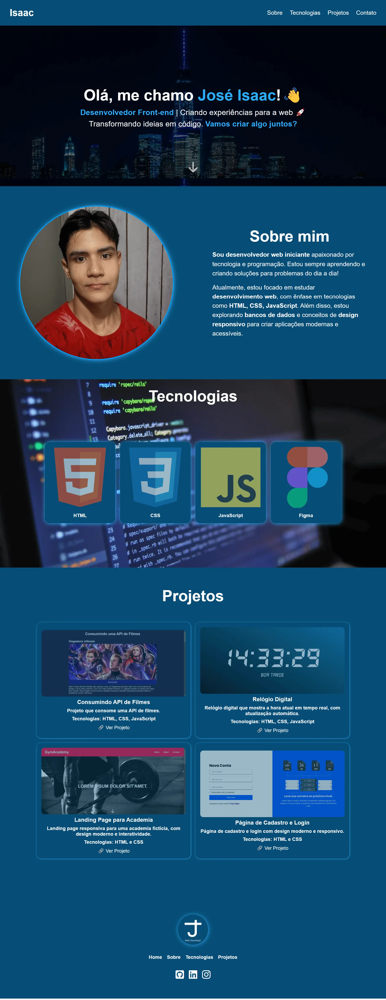
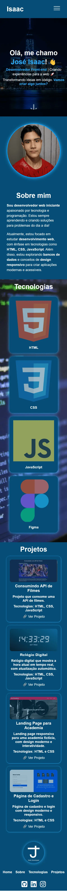

# Portfólio Pessoal

Este é o meu portfólio pessoal, desenvolvido com HTML e CSS, utilizando conceitos de Flexbox e Grid para criar um layout responsivo e moderno.

## 📌 Tecnologias Utilizadas

- **HTML5**
- **CSS3**

## 🚀 Funcionalidades

- ✅ Design responsivo para diferentes dispositivos
- ✅ Listagem de projetos
- ✅ Links para redes sociais e contato

## 📂 Como Rodar o Projeto

1. Baixe ou clone este repositório:
   ```bash
   git clone https://github.com/joseisaacpy/developer-portfolio.git
   ```
2. Abra o arquivo `index.html` no seu navegador.

## 📷 Demonstração

### 💻 Versão Desktop


### 📱 Versão Mobile


## 📌 Melhorias Futuras

- Adicionar JavaScript para interações dinâmicas
- Melhorias no design e animações
